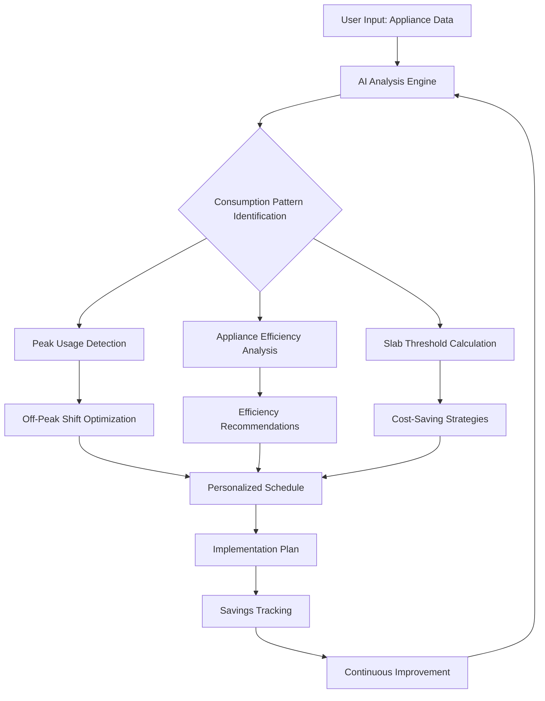

<div align="center">
  
# Kifayat ⚡💰

[](https://opensource.org/licenses/MIT)
[](http://makeapullrequest.com)
[](https://github.com/yourusername/kifayat/actions)
[](https://github.com/yourusername/kifayat/issues)
[](https://github.com/yourusername/kifayat/stargazers)


### *Kifayat Shuari, Bijli Bachat* 🇵🇰
#### AI-Powered Electricity Optimization for Pakistani Households

[View Demo](https://kifayat.pk) • [Report Bug](https://github.com/yourusername/kifayat/issues) • [Request Feature](https://github.com/yourusername/kifayat/issues)

</div>

---

## 📊 Dashboard Preview

<div align="center">
  
</div>

## ✨ Key Features

<table>
  <tr>
    <td width="50%">
      <h3 align="center">💡 Personalized Consumption Analysis</h3>
      <p align="center">
        
      </p>
      <p align="center">Detailed assessment of household electricity usage patterns</p>
    </td>
    <td width="50%">
      <h3 align="center">🤖 AI-Powered Optimization</h3>
      <p align="center">
        
      </p>
      <p align="center">Custom recommendations for shifting usage to off-peak hours</p>
    </td>
  </tr>
  <tr>
    <td width="50%">
      <h3 align="center">📱 Bilingual Support</h3>
      <p align="center">
        
      </p>
      <p align="center">Full functionality in both Urdu and English</p>
    </td>
    <td width="50%">
      <h3 align="center">📅 Usage Scheduling Assistant</h3>
      <p align="center">
        
      </p>
      <p align="center">Planning tool for optimal appliance usage timing</p>
    </td>
  </tr>
</table>

## 🧠 How It Works



## 📈 Impact Calculator

<div align="center">
  <table>
    <tr>
      <td>Monthly Units Saved</td>
      <td>Monthly Cost Saved (PKR)</td>
      <td>Annual Savings (PKR)</td>
    </tr>
    <tr>
      <td><input type="number" min="0" max="500" value="50" id="units" onchange="calculate()"></td>
      <td><span id="monthly">2,500</span></td>
      <td><span id="annual">30,000</span></td>
    </tr>
  </table>

  <small>*Based on average PKR 50/unit cost</small>
</div>

<script>
function calculate() {
  const units = document.getElementById('units').value;
  const monthly = units * 50;
  document.getElementById('monthly').textContent = monthly.toLocaleString();
  document.getElementById('annual').textContent = (monthly * 12).toLocaleString();
}
</script>

## 🚀 Quick Start

<details>
<summary>Click to expand installation instructions</summary>

### Prerequisites

- Node.js v16.0+
- MongoDB v5.0+
- npm v8.0+

### Installation

1. Clone the repository
   ```bash
   git clone https://github.com/yourusername/kifayat.git
   cd kifayat
   ```

2. Install dependencies
   ```bash
   npm install
   ```

3. Set up environment variables
   ```bash
   cp .env.example .env
   ```
   Edit the `.env` file with your configuration details

4. Start the development server
   ```bash
   npm run dev
   ```

5. Build for production
   ```bash
   npm run build
   ```

</details>

## 💡 Usage Examples

<details>
<summary>Appliance Scheduling</summary>

```javascript
// Example code for scheduling appliances
const KifayatScheduler = require('./services/scheduler');

const scheduler = new KifayatScheduler({
  appliance: 'washing_machine',
  duration: 60, // minutes
  preferred_time_range: ['18:00', '22:00'],
  flexibility: 'high'
});

const optimalTime = scheduler.findOptimalTime();
console.log(`Optimal time to run washing machine: ${optimalTime}`);
```

</details>

<details>
<summary>Consumption Analysis</summary>

```javascript
// Example code for analyzing consumption
const KifayatAnalyzer = require('./services/analyzer');

const analyzer = new KifayatAnalyzer({
  household_size: 4,
  appliances: [
    { type: 'refrigerator', power: 150, hours: 24 },
    { type: 'air_conditioner', power: 1500, hours: 6 },
    { type: 'television', power: 100, hours: 5 }
  ],
  historical_data: lastThreeMonths
});

const analysis = analyzer.generateReport();
console.log(`Monthly consumption: ${analysis.total_kwh} kWh`);
console.log(`Potential savings: ${analysis.potential_savings} PKR`);
```

</details>

## 📊 Electricity Cost Trends in Pakistan

<div align="center">
  
</div>

## 🔌 Typical Pakistani Household Appliance Usage

| Appliance | Power (Watts) | Daily Usage (Hours) | Monthly Consumption (kWh) |
|-----------|---------------|---------------------|---------------------------|
| Fan | 80 | 8 | 19.2 |
| Air Conditioner | 1500 | 6 | 270 |
| Refrigerator | 150 | 24 | 108 |
| Television | 100 | 5 | 15 |
| Washing Machine | 500 | 1 | 15 |
| Water Pump | 750 | 2 | 45 |
| Microwave | 1200 | 0.5 | 18 |
| Iron | 1000 | 0.5 | 15 |
| **Total** | | | **505.2** |

## 🧩 Project Structure

<details>
<summary>Click to view project structure</summary>

```
kifayat/
├── client/                 # Frontend application
│   ├── public/             # Static assets
│   └── src/                # Source files
│       ├── components/     # UI components
│       ├── pages/          # Application pages
│       ├── services/       # API services
│       └── utils/          # Utility functions
├── server/                 # Backend application
│   ├── api/                # API routes
│   ├── models/             # Database models
│   ├── services/           # Business logic
│   └── utils/              # Utility functions
├── ai-engine/              # AI recommendation engine
│   ├── models/             # ML models
│   ├── data/               # Training data
│   └── services/           # Prediction services
└── docs/                   # Documentation
```

</details>

## 🔧 API Reference

<details>
<summary>Click to view API documentation</summary>

### Authentication

```http
POST /api/auth/register
```

| Parameter | Type | Description |
| :--- | :--- | :--- |
| `name` | `string` | **Required**. User's name |
| `email` | `string` | **Required**. User's email |
| `password` | `string` | **Required**. User's password |

```http
POST /api/auth/login
```

| Parameter | Type | Description |
| :--- | :--- | :--- |
| `email` | `string` | **Required**. User's email |
| `password` | `string` | **Required**. User's password |

### Appliances

```http
GET /api/appliances
```

Returns all appliances registered for the authenticated user.

```http
POST /api/appliances
```

| Parameter | Type | Description |
| :--- | :--- | :--- |
| `type` | `string` | **Required**. Appliance type |
| `brand` | `string` | Appliance brand |
| `model` | `string` | Appliance model |
| `power` | `number` | **Required**. Power consumption in watts |
| `usage_hours` | `number` | **Required**. Daily usage in hours |

### Recommendations

```http
GET /api/recommendations
```

Returns personalized recommendations based on the user's appliance usage pattern.

</details>

## 🤝 Contributing

<details>
<summary>Click to view contribution guidelines</summary>

1. Fork the repository
2. Create a new branch (`git checkout -b feature/amazing-feature`)
3. Make your changes
4. Run tests (`npm test`)
5. Commit your changes (`git commit -m 'Add some amazing feature'`)
6. Push to the branch (`git push origin feature/amazing-feature`)
7. Open a Pull Request

</details>

## 📊 Data Sources

- National Electric Power Regulatory Authority (NEPRA) reports
- Pakistan Bureau of Statistics electricity consumption data
- Power Information Technology Company (PITC) peak usage data
- Distribution company pricing slabs

## 📜 License

This project is licensed under the MIT License - see the [LICENSE](LICENSE) file for details.

## 👥 Core Team

<div align="center">
  <table>
    <tr>
      <td align="center">
        
        <br />
        <sub><b>John Doe</b></sub>
        <br />
        <sub>Project Lead</sub>
      </td>
      <td align="center">
        
        <br />
        <sub><b>Jane Doe</b></sub>
        <br />
        <sub>AI Engineer</sub>
      </td>
      <td align="center">
        
        <br />
        <sub><b>Alice Smith</b></sub>
        <br />
        <sub>Frontend Developer</sub>
      </td>
      <td align="center">
        
        <br />
        <sub><b>Bob Smith</b></sub>
        <br />
        <sub>Backend Developer</sub>
      </td>
    </tr>
  </table>
</div>

## 📞 Contact

- Project Lead: [project-lead@kifayat.pk](mailto:project-lead@kifayat.pk)
- Technical Support: [support@kifayat.pk](mailto:support@kifayat.pk)
- Website: [www.kifayat.pk](https://www.kifayat.pk)

---

<div align="center">
  
  [](https://github.com/yourusername/kifayat)
  
  **Built with ❤️ for Pakistan's Energy Future**
  
  © 2025 Kifayat. All Rights Reserved.
  
</div>
